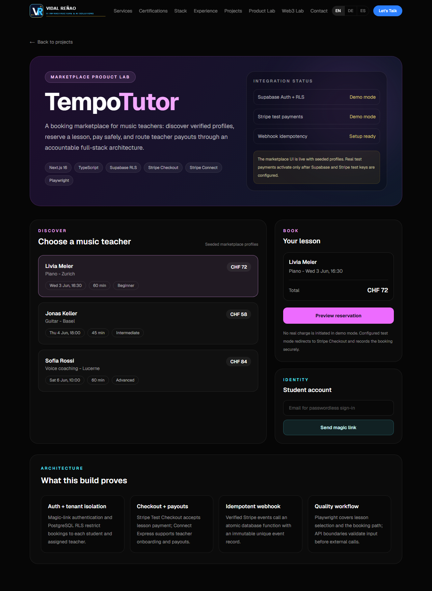
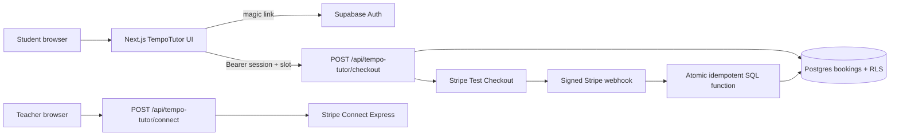

# TempoTutor Marketplace Lab

TempoTutor is a music-lesson marketplace product lab built to demonstrate full-stack ownership for a greenfield marketplace: public discovery, authenticated booking, Stripe test payment, teacher payouts and secure processing of asynchronous payment events.

## Live Route

- English: `/en/labs/tempo-tutor`
- German: `/de/labs/tempo-tutor`
- Spanish: `/es/labs/tempo-tutor`

Without private environment variables the public interface remains usable in transparent demonstration mode. With Supabase and Stripe test keys configured, the same UI activates authentication and real Stripe Test Checkout.



## Stack And Scope

| Concern | Implementation |
| --- | --- |
| Framework | Next.js 16 App Router, React, TypeScript |
| Database / Auth | Supabase PostgreSQL, magic-link Auth, RLS |
| Student payment | Stripe Checkout in test mode |
| Teacher payouts | Stripe Connect Express onboarding endpoint |
| Webhook safety | Verified signature plus atomic idempotent SQL function |
| Quality | Playwright end-to-end coverage for selection and booking preview |
| Localization | next-intl in English, German and Spanish |

## Architecture



## Security Decisions

1. Checkout creation requires a verified Supabase user session; anonymous browser requests cannot insert a booking.
2. RLS ensures a student sees their own booking and a teacher sees only assigned bookings.
3. Stripe secrets and the Supabase service-role key remain server-only.
4. Webhook signatures are verified before database processing.
5. A partial unique index prevents two active bookings from holding the same lesson slot.
6. Stripe Checkout sessions expire after approximately 30 minutes; the signed expiration webhook releases an unpaid slot.
7. `tempo_process_checkout_event` inserts an immutable Stripe event ID and updates a booking in one database transaction. Replayed webhooks return without applying a second state transition.
8. Request bodies are validated with `zod` at API boundaries.

## Test Configuration

1. Create a Supabase project and execute [`supabase/tempo-tutor-marketplace.sql`](../supabase/tempo-tutor-marketplace.sql).
2. Copy the variable names from [`docs/tempo-tutor.env.example`](./tempo-tutor.env.example) into `.env.local` and add test values.
3. In Stripe Test Mode, forward events to the local webhook:

```bash
stripe listen --forward-to localhost:3000/api/webhooks/stripe/tempo-tutor
```

4. Run the product locally:

```bash
npm run dev
```

5. Run UI tests:

```bash
npm run test:e2e
```

## Matchspace Application Evidence

**Most end-to-end project:** TempoTutor demonstrates product architecture, marketplace UX, tenant-aware database design, auth, payment boundaries, webhook handling, localization and testing in one Next.js application.

**AI coding setup:** Development is performed with an agentic coding workflow under explicit guardrails: inspect existing architecture first, validate every external boundary, keep secrets server-side, run lint/build/tests, and review generated SQL and payment code manually before shipping.

**Security-sensitive system:** Booking data is protected by RLS and authenticated insertion; a slot cannot be double-held; Stripe event processing is signature-verified, transactionally idempotent and releases expired payment reservations.

**Greenfield trade-offs:** Static seeded teacher discovery keeps the public lab deterministic, while payment and identity integrations are real adapters activated through test configuration. No early microservices; route handlers and one SQL migration keep the MVP auditable.
